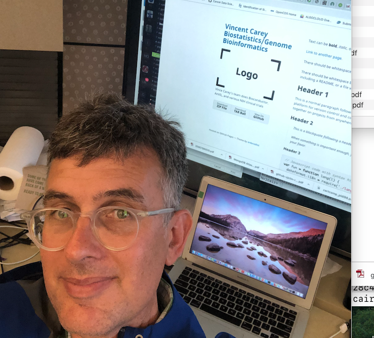

 
 
<table border="0">
 <tr>
    <td><b style="font-size:30px">  </b></td>
    <td><b style="font-size:30px">  </b></td>
    <td><b style="font-size:30px">  </b></td>
 </tr>
 <tr>
<td>

</td>
<td colspan="2">
 

Vince Carey, Ph.D., is Professor of Medicine at Channing Division of Network
Medicine, Mass General Brigham, Harvard Medical School.
</td>
 </tr>

 <tr>
    <td><b style="font-size:30px">  </b></td>
    <td><b style="font-size:30px">  </b></td>
    <td><b style="font-size:30px">  </b></td>
 </tr>

 <tr>

<td>
## Projects

- Bioconductor
- NHGRI AnVIL
- NIA MIND
- NIA NOURISH
</td>

<td>
## Team members

- Bioconductor core devs
    - Herve Pages
    - Lori Shepherd Kern
    - Marcel Ramos
    - Jen Wokaty
    - Alex Mahmoud
    - Bob Shear

- Channing Division of Network Medicine
    - Nancy Laranjo
    - BJ Stubbs
    - Xavier Reilly
    - Sara Stankiewicz
    - Alex Mahmoud
    - Madeline Carpenter
</td>
<td>
## Themes and tools

- computational genomic data science
    - ontoproc/pogos
    - htx
    - BiocHail
    - gwascat/gwaslake
    - TFutils
    - scviR
    - education
        - CSHL
        - YESCDS

- clinical informatics
    - BiocFHIR

- statistical methodology
    - GEE
    - ALR
    - RDEC
    - barca
</td>
 </tr>
</table>
