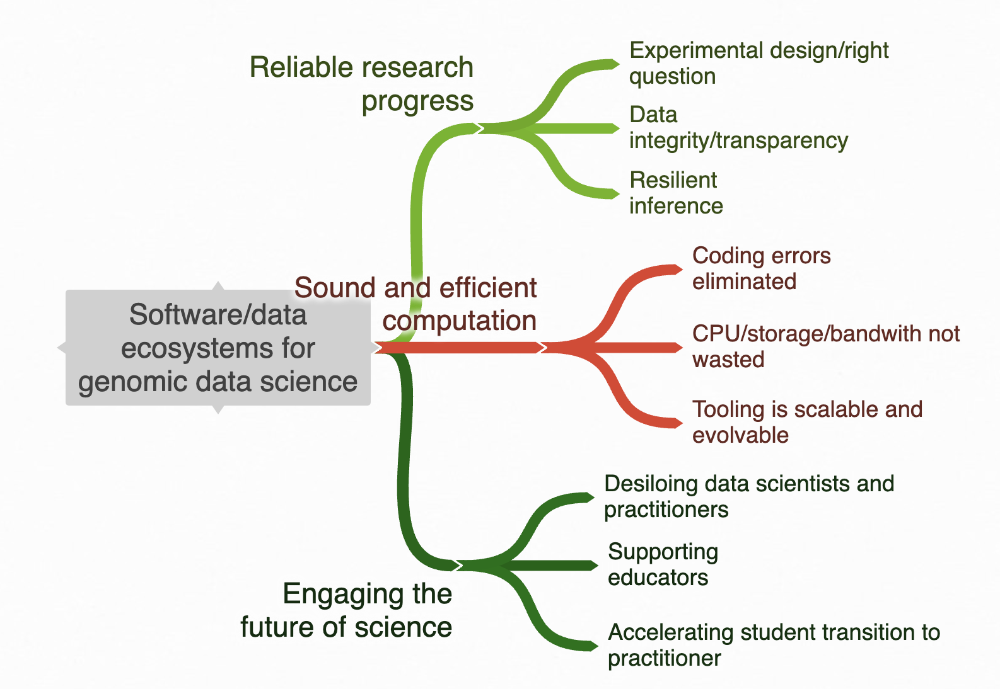

 
 
<table border="0">
 <tr>
    <td><b style="font-size:30px">  </b></td>
    <td><b style="font-size:30px">  </b></td>
    <td><b style="font-size:30px">  </b></td>
 </tr>
 <tr>
<td colspan="2">

</td>
<td colspan="2">
 

Vince Carey, Ph.D., is Professor of Medicine at Channing Division of Network
Medicine, Mass General Brigham, Harvard Medical School.

As a Fulbright Specialist and as an invited lecturer, he has given short courses in statistical genomics on four continents. He was an inaugural faculty member in the Cold Spring Harbor Laboratory Summer Course on statistical analysis of genome-scale data (2005-2010 and intermittently thereafter), and in 2009 was inaugural Editor-in-Chief of The R Journal. 

A founding contributor to the Bioconductor project in 2001, Vince is now MPI of the
[NHGRI U24](https://reporter.nih.gov/search/VqeRdGREj0SNE3kZAPXvdg/project-details/10806984) supporting core 
developer activities.  He is also MPI of the NHGRI [AnVIL](https://anvilproject.org) cloud computing platform. 

Vince has led several Chan-Zuckerberg Initiative Essential Open Source Software projects
addressing enhanced community support and inclusiveness.  One outcome is the [YESCDS](https://vjcitn.github.io/YESCDS)
curriculum for introductory genomic data science with applications to cancer.

As of 2024 Vince is a member of the Scientific Advisory Board of the [Vaccine and Immunology Statistical Center](https://ghdiscoverycollaboratory.org/platforms/vaccine-immunology-statistical-center) of the Collaboration for AIDS Vaccine Discovery, and of the External Advisory Board for [NIAID ImmPort](https://www.immport.org/home).
</td>
 </tr>

<!--
https://pubmed.ncbi.nlm.nih.gov/31792435/  orch sc

https://pubmed.ncbi.nlm.nih.gov/35199087/ anvil

https://pubmed.ncbi.nlm.nih.gov/25633503/ bioc 2015

https://pubmed.ncbi.nlm.nih.gov/32023372/ vdaart

https://pubmed.ncbi.nlm.nih.gov/25514303/ omnicarb

https://pubmed.ncbi.nlm.nih.gov/19246357/ pounds lost

https://pubmed.ncbi.nlm.nih.gov/15351753/ pac port

https://pubmed.ncbi.nlm.nih.gov/2785883/ HIV immunology
-->

 <tr>
    <td><b style="font-size:30px">  </b></td>
    <td><b style="font-size:30px">  </b></td>
    <td><b style="font-size:30px">  </b></td>
 </tr>

 <tr>

<td>
## Projects

- Bioconductor
- NHGRI AnVIL
- NIA MIND
- NIA NOURISH
</td>

<td>
## Team members

- Bioconductor core devs
    - Herve Pages
    - Lori Shepherd Kern
    - Marcel Ramos
    - Jen Wokaty
    - Alex Mahmoud

- Channing Division of Network Medicine
    - Nancy Laranjo
    - Xavier Reilly
    - Sara Stankiewicz
    - Alex Mahmoud
    - Madeline Carpenter
</td>
<td>
## Themes and tools

- computational genomic data science
    - ontoproc/pogos
    - BiocHail
    - gwascat/gwaslake
    - TFutils
    - scviR
    - education
        - CSHL
        - YESCDS

- clinical informatics
    - BiocFHIR

- statistical methodology
    - GEE
    - ALR
    - RDEC
    - barca
</td>
 </tr>
</table>
