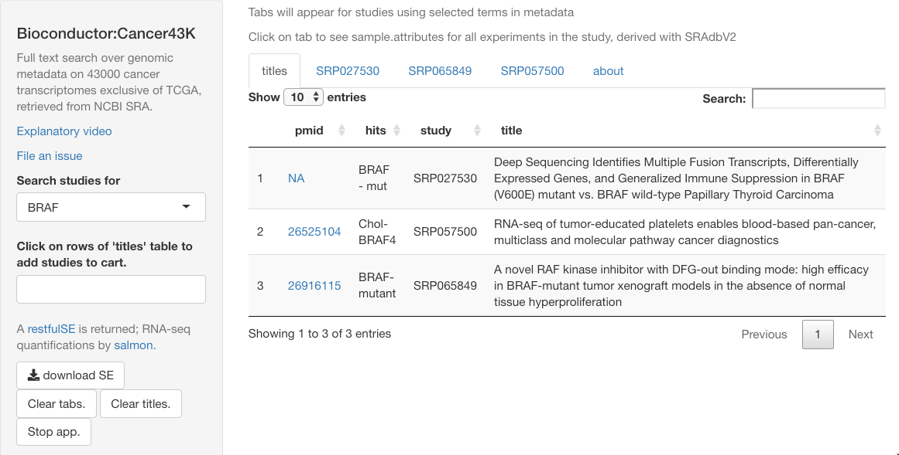
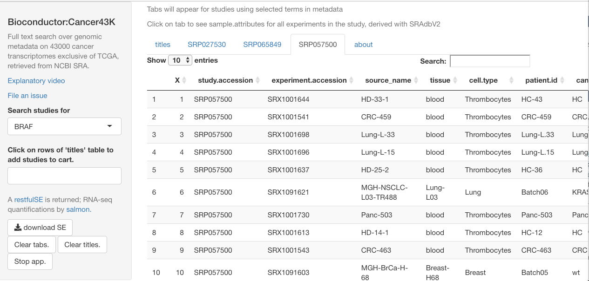
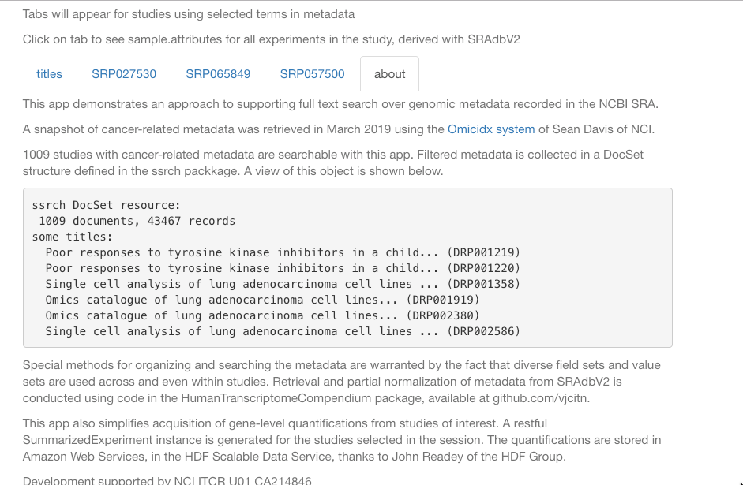

## Access to 43000 cancer-related transcriptomes not in TCGA

[Live app](http://vjcitn.shinyapps.io/ca43k)...[Source code](http://github.com/vjcitn/HumanTranscriptomeCompendium)

This is a result of a collaborative effort with Dr Sean
Davis of NCI Center for Cancer Research and John Readey
of the HDF Group.  The basic idea is that Sean's OmicIDX
and BigRNA APIs have been used to create snapshots of 
cancer-related RNA-seq studies and associated metadata.

The quantifications were set up for global distributon
via the HDF Scalable Data Service (HSDS), and SummarizedExperiment
interfaces were set up via the restfulSE package.

The user can click on a study to add it to the "cart" which
will define a RESTful SummarizedExperiment for downloading.
The SummarizedExperiment will include data and metadata from all
selected studies, but assay data will not be downloaded.  Instead,
the assay data are referenced through the DelayedArray protocol,
retrieved, ultimately, as needed via HSDS.

Tab panels provide searchable tables of all available sample-level
metadata.

The "about" tab describes some details of metadata handling.

[back](./)
