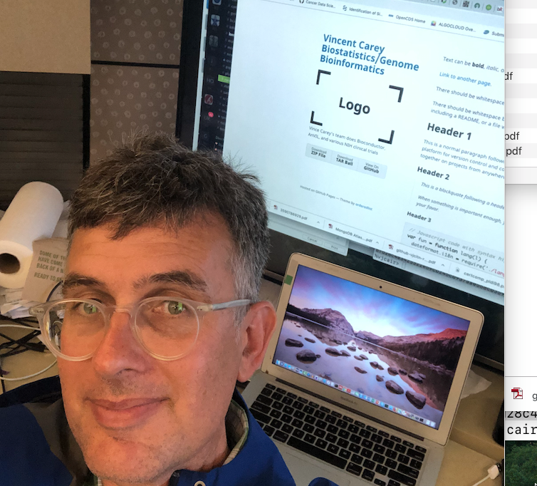

## Our institutional and physical homes

* [Channing Division of Network Medicine](https://www.brighamandwomens.org/research/departments/channing-division-of-network-medicine/overview)
* [Landmark Center Boston](https://en.wikipedia.org/wiki/Landmark_Center_(Boston))

## Recent talks

* [Software ecosystem concepts for federated genomic data science](https://docs.google.com/presentation/d/1LMR3upAQZMdfAP4-UAl6-UMU6udA_NkqRMKsnM1jPfs/edit?usp=sharing)
* [GA4GH meets Bioconductor](https://docs.google.com/presentation/d/1wmv0wfLqYhZOcvqIA1lanypH0dtQ_hukJfBOuVw1Jzs/edit?usp=sharing)
* [Clustering and visualization from CSAMA 2019](https://docs.google.com/presentation/d/1LvmkXajzX13qJNfIQDtoqsSL031xMu0-5SQBJXSKjzA/edit?usp=sharing)

## Our apps for genomic data science

* [Interpreting RNA-seq derived haplotypes](./phaser.html)
* [Exploring and retrieving subsets of 43000 cancer transcriptomes not in TCGA](./ca43k.html)
* [Exploring the IvyGAP Glioblastoma RNA-seq data with image-derived phenotyping](./ivygap.html)

## Software (aka the Channingverse)

* [Annotated index](./chanPacks.html)

### More resources and references coming soon!  This site was begun 20 June 2019!

