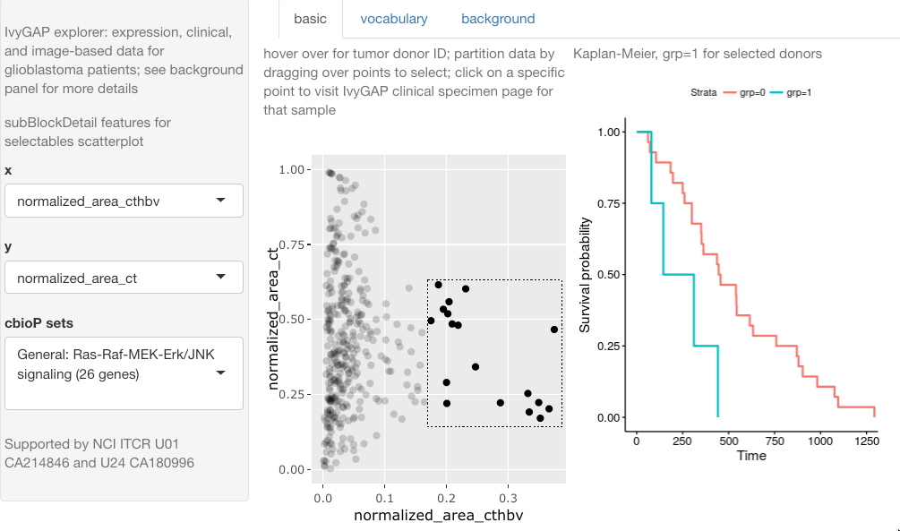

## Exploring IvyGAP Glioblastoma RNA-seq and imaging data

[Live app](http://vjcitn.shinyapps.io/ivyglimpse)...[Source code](http://github.com/vjcitn/ivygapSE)

This app is fairly self-explanatory.

Use the ivygapSE package from Bioconductor to work with the
data directly.
