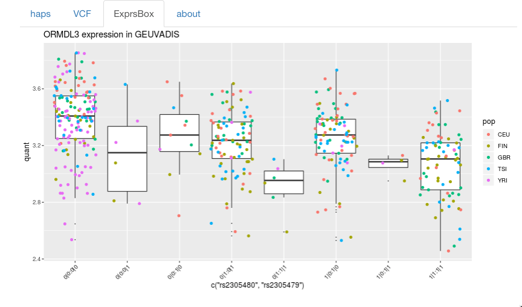

## Prototypical use of RNA-seq-derived haplotypes based on phASER

[Live app](http://vjcitn.shinyapps.io/phaserRnaHap0)...[Source code](http://github.com/vjcitn/BiocRnaHap)

This is a result of a collaborative effort in the NHGRI
Computational Medicine Hackathon to commence a realization
of Ben Busby's vision of haplotype inference based on 
RNA-seq (and possibly 'global screening arrays').  

Martin Steinegger wrangled
phASER ([Castel et al. 2016 paper](https://www.nature.com/articles/ncomms12817); [github repo for phASER source](https://github.com/secastel/phaser)) to obtain a set of haplotype assertions for NA06896.  These are
wrapped up in an R package defining various methods for
combining these SNP configurations with annotation and expression data.
For this app, we take advantage of the GEUVADIS RNA-seq quantifications
in the Bioconductor [geuvPack](http://bioconductor.org/packages/geuvPack/)
package.

The interface is currently gene-centric.  After entering a gene
symbol, RNA-derived haplotypes present within a certain
radius around the gene body are tabulated.

The user can click on one row to obtain GEUVADIS genotypes for
the selected SNPS.  The expression data for the selected gene
is then stratified by the implied haplotypes and plotted.

[back](./)
