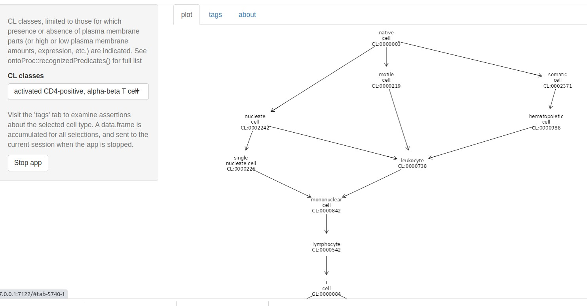

# ontoProc

This package enables users to explore and visualize relationships among
concepts enumerated in biomedical ontologies.

## Basic representations

[ontoProc](https://bioconductor.org/packages/ontoProc) uses AnnotationHub
to manage ontology representations.  We can retrieve a recent version of
the UBERON ontology as follows:

```{r lkann,message=FALSE}
library(AnnotationHub)
ah = AnnotationHub()
query(ah, "ontoProc")
library(ontoProc)
ub = getOnto("uberon")
head(names(ub))
ub$name[1:10]
```

## Visualization

We take advantage of Daniel Greene's 
[ontologyIndex suite of packages](https://academic.oup.com/bioinformatics/article/33/7/1104/2843897)
to produce visualizations of concept relationships.

```{r lkopr,message=FALSE}
cl = ontoProc::getOnto('cellOnto')
cl3k = c("CL:0000492", "CL:0001054", "CL:0000236", "CL:0000625",
    "CL:0000576", "CL:0000623", "CL:0000451", "CL:0000556")
ontoProc::onto_plot2(cl, cl3k)
```

## Interactive app

The `ctmarks` function defines a shiny app that
addresses cell-type-defining marker genes.
Users select a cell type, and its position in
the Cell Ontology network is rendered.



Using available inter-ontology relationships,
protein and transcriptional annotations for the
cell type are tabulated.


# pogos

The [pogos package](https://bioconductor.org/pogos)
confronts the relationships between ontologies for cells
and cell lines and compounds used in pharmacology and
pharmacogenomics.

The Cancer Cell Line Encyclopedia (CCLE) includes datasets
describing sensitivity of cell lines to drugs.
pogos provides tools for querying the PharmacoDB system
and rendering sensitivity results from CCLE.

```{r doccl,message=FALSE}
library(pogos)
iri = iriCCLE()
iri
plot(iri)
```


# Other tools

Bioconductor includes the [rols](https://bioconductor.org/packages/rols)
package that interrogates the EBI Ontology Lookup Service.
